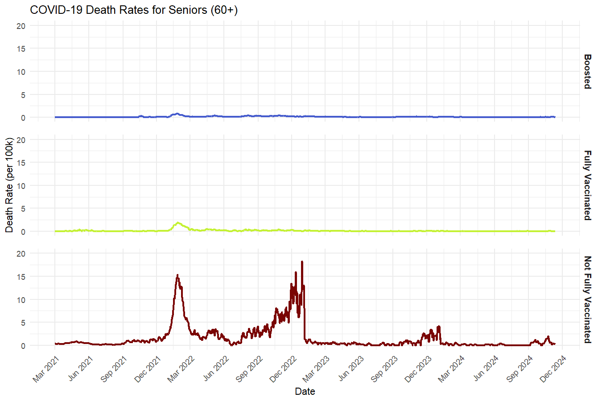
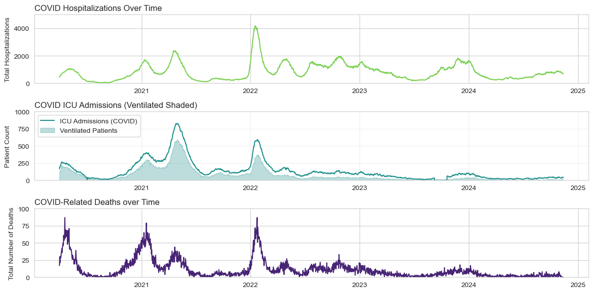

# Data Visualization

## Assignment 3: Final Project

### Requirements:
- We will finish this class by giving you the chance to use what you have learned in a practical context, by creating data visualizations from raw data. 
- Choose a dataset of interest from the [City of Toronto’s Open Data Portal](https://www.toronto.ca/city-government/data-research-maps/open-data/) or [Ontario’s Open Data Catalogue](https://data.ontario.ca/). 
- Using Python and one other data visualization software (Excel or free alternative, Tableau Public, any other tool you prefer), create two distinct visualizations from your dataset of choice.  
- For each visualization, describe and justify: 
>Visualization using R Studio
    > What software did you use to create your data visualization?
        > I used R Studio (ggplot) 
    > Who is your intended audience? 
        > General public
    > What information or message are you trying to convey with your visualization? 
        > The goal was to demonstrate differences in death rates for an at-risk population (older adults; 60+)
        broken down by vaccination status during the later waves of the COVID-19 pandemic. Another goal was to demonstrate the peaks and plateaus of COVID-caused deaths over time. Together, the graphs show both the potential benefits (of course, this data is correlational) of vaccines while also showing the predictable cyclical nature of death rates (and, reasonably inferred, infection rates). If I had more time, I would've liked to impose this graph over COVID-related hospital or ICU visits, but I thought this was sufficient for the assignment.
    > What aspects of design did you consider when making your visualization? How did you apply them? With what elements of your plots? 
        > At a basic level, for comparison, I split up vaccination status across three graphs to avoid high overlap between the vaccinated and boosted populations' trends. I also wanted to make that comparison more obvious through the addition of colour for each group within vacination status. I used a line graph to plot this data as we're looking at general trends over times (there aare cycles, but those cycles shrink each new wave).
    > How did you ensure that your data visualizations are reproducible? If the tool you used to make your data visualization is not reproducible, how will this impact your data visualization? 
        > The data itself is obviously open-source. R Studio and the packages I used are also open-source. Normally, I'd also link to a repository like OSF to provide all of the code and files I used. I have also explained my decisions throughout the code in comments.
    > How did you ensure that your data visualization is accessible?  
        > I did make an effort to test out and use viridis for the coloring of my groups, but I also split the graphs up by the same groupings so that color only acts as an additional channel to communicate the categories of vaccination status. For coloring, I adjusted the default viridis options to ensure that the contrast between the lines and white background were high (many defaults used a low-saturation yellow). Finally, I always avoid using serif fonts for the sake of ease when reading (especially for the smaller fonts).
    > Who are the individuals and communities who might be impacted by your visualization?  
        > Probably older adults or their families. Seeing the difference in trends for vaccinated and "boosted"
        older adults versus non-fully-vaccinated is striking, given that they're left on the same scale. It also communicates the "peak" risk times of the COVID cycle (i.e., consistent spikes during winter months).
    > How did you choose which features of your chosen dataset to include or exclude from your visualization? 
        > I spent far longer than I should've debating between options for this viz. Whether or not to smooth the lines, how to provide some form of legend or labels, the Y-axis scales, and how to format the facet wrapping of the texts. In terms of the actual dataset, I was fairly inclusive, but I excluded younger ages as I didn't see them as a particularly at-risk population, albeit it still might be interesting to look at their trends (and I did end up doing so).
    > What ‘underwater labour’ contributed to your final data visualization product?
        > This feels like a hard question to definitively answer, but the obvious few are the healthcare workers documenting all of this data (especially during the pandemic, on the front-lines), the government employees aggregating and organizing/procesing the data, the IT teams in charge of managing and updating the data repository on the government's websites, the teams behind R Studio and the packages I used (tidyverse/dplyr, ggubr/ggplot).
>Visualization using Python    
    > What software did you use to create your data visualization?
        > I used Python 
    > Who is your intended audience? 
        > This seems to be general, but maybe information for policymakers specifically (still lay-people)
    > What information or message are you trying to convey with your visualization? 
        > The goal of the visualization is to communicate the trends over time (same time period due to data limits) in terms of deaths and hospitalizations. Specifically, while deaths were fairly high, they dropped off significantly after 2022 whereas hospitalizations and ICU visits remained fairly high. It shows (I think) a promising trend that while hospitalizations may be high at that time point, deaths and ventilated ICU patients (i.e., the "most severe" cases) were trending significantly downwards. Obviously, hindsight is 20/20 and we know that the trend went down as COVID became less deadly (and more were vaccinated).
    > What aspects of design did you consider when making your visualization? How did you apply them? With what elements of your plots? 
        > I followed a very similar general design to my R plot, but for a slightly different goal. In the R plot, I wanted to provide a contrast of how certain groups were doing in terms of the severity of death rates among an at-risk group. Here, the goal was to provide 3 trends of related outcomes due to COVID-19 (hospitalizations, ICU visits and ventilations, and deaths) and investigate whether or not the trends were moving "tightly" together, or if there was a divergence. So, again, the plots were created in a vertical sequence in terms of severity of outcomes (with an accessible color gradient matching to the outcomes). I thought it would be cool to include the shaded region of ventilated patients at the ICU to show that, early on, many patients were ventilated, but that proportion died down over time.
    > How did you ensure that your data visualizations are reproducible? If the tool you used to make your data visualization is not reproducible, how will this impact your data visualization? 
        > Given that these were made in Python with open-source packages, I think it is highly reproducible. I would also post the code for these (along with data). Finally, I have commented throughout, maybe too much, explaining for others (and my own future reference) how each step functions.
    > How did you ensure that your data visualization is accessible?  
        > I relied on viridis for gradient coloring along with splitting outcomes up by graph as well. Titles used sans-serif fonts.
    > Who are the individuals and communities who might be impacted by your visualization?  
        > I guess policymakers, healthcare workers, and the general population. This kind of information lets everyone know where the most concerning outcomes are headed and allows us to make better decisions at a policy-level (e.g., do we lockdown/enforce mandates for public health and safety or ease up) and personal-level (e.g., do I wear a mask at family gatherings where I know at-risk people will be, should I continue distancing, vaccinations, etc.) as a result of the observed trends (i.e., deaths are trending down but hospitalizations and ICU visits remain fairly high, albeit with less peaks from the waves of COVID). It also might give some additional vindication to front-line staff at health care facilities feeling burnt out as the visitations remained so high throughout multiple years. One limitation that could be solved with more time/another visualzation is if these cases are concentrated at certain hospitals (i.e., maybe some hospitals/ICUs were particularly overwhelmed). Knowing this would be much more valuable for policy in terms of resource allocation.
    > How did you choose which features of your chosen dataset to include or exclude from your visualization? 
        > I feel I was fairly inclusive as I ended up combining two datasets to show a more comprehensive picture of outcomes. I simply chose to remove variables that looked at COVID-related critical illnesses (CRCIs) as I wanted to focus on purely COVID-caused as a conservative picture, but it would be helpful to also include those additional counts as well in a more inclusive visualization.
    > What ‘underwater labour’ contributed to your final data visualization product?
        > Pretty much identical to the R plot content: healthcare workers documenting all of this data (especially during the pandemic, on the front-lines), the government employees aggregating and organizing/procesing the data, the IT teams in charge of managing and updating the data repository on the government's websites, the teams behind the Python packages I used.

- This assignment is intentionally open-ended - you are free to create static or dynamic data visualizations, maps, or whatever form of data visualization you think best communicates your information to your audience of choice! 
- Total word count should not exceed **(as a maximum) 1000 words** 
 
### Why am I doing this assignment?:  
- This ongoing assignment ensures active participation in the course, and assesses the learning outcomes: 
* Create and customize data visualizations from start to finish in Python
* Apply general design principles to create accessible and equitable data visualizations
* Use data visualization to tell a story  
- This would be a great project to include in your GitHub Portfolio – put in the effort to make it something worthy of showing prospective employers!

### Rubric:

| Component         | Scoring  | Requirement                                                                 |
|-------------------|----------|-----------------------------------------------------------------------------|
| Data Visualizations | Complete/Incomplete | - Data visualizations are distinct from each other - Data visualizations are clearly identified - Different sources/rationales (text with two images of data, if visualizations are labeled) - High-quality visuals (high resolution and clear data) - Data visualizations follow best practices of accessibility |
| Written Explanations | Complete/Incomplete | - All questions from assignment description are answered for each visualization - Explanations are supported by course content or scholarly sources, where needed |
| Code              | Complete/Incomplete | - All code is included as an appendix with your final submissions - Code is clearly commented and reproducible |

## Submission Information

🚨 **Please review our [Assignment Submission Guide](https://github.com/UofT-DSI/onboarding/blob/main/onboarding_documents/submissions.md)** 🚨 for detailed instructions on how to format, branch, and submit your work. Following these guidelines is crucial for your submissions to be evaluated correctly.

### Submission Parameters:
* Submission Due Date: `23:59 - 09/05/2025`
* The branch name for your repo should be: `assignment-3`
* What to submit for this assignment:
    * A folder/directory containing:
        * This file (assignment_3.md)
        * Two data visualizations 
        * Two markdown files for each both visualizations with their written descriptions.
        * Link to your dataset of choice.
        * Complete and commented code as an appendix (for your visualization made with Python, and for the other, if relevant) 
* What the pull request link should look like for this assignment: `https://github.com/<your_github_username>/visualization/pull/<pr_id>`
    * Open a private window in your browser. Copy and paste the link to your pull request into the address bar. Make sure you can see your pull request properly. This helps the technical facilitator and learning support staff review your submission easily.

Checklist:
- [ ] Create a branch called `assignment-3`.
- [ ] Ensure that the repository is public.
- [ ] Review [the PR description guidelines](https://github.com/UofT-DSI/onboarding/blob/main/onboarding_documents/submissions.md#guidelines-for-pull-request-descriptions) and adhere to them.
- [ ] Verify that the link is accessible in a private browser window.

If you encounter any difficulties or have questions, please don't hesitate to reach out to our team via our Slack. Our Technical Facilitators and Learning Support staff are here to help you navigate any challenges.
